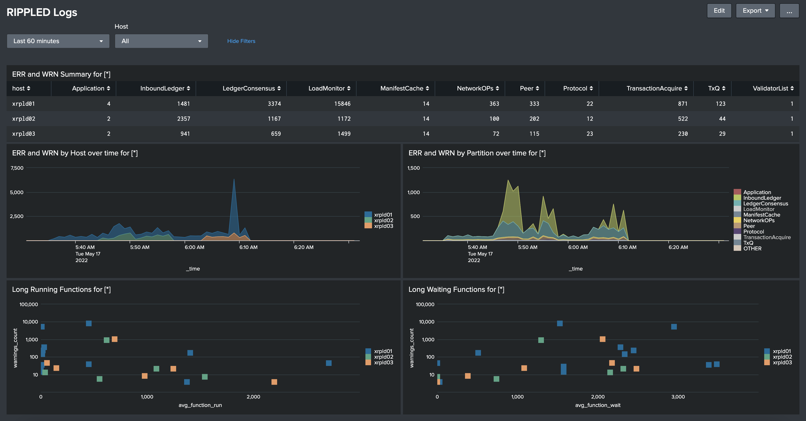

# XRPL Explorer
This is app provides parsing and visualisation for the XRP Ledger and rippled logs. 
It is intended to be used as part of Splunk ecosystem.

## Current Features
### Parsing rippled log and visualisation
#### Search time field extractions for `log_partiion`, `log_severity` and `log_message` enable easier search across the data. 

#### RIPPLED Logs dashboard.  

Provides overview of the rippled.  
Will surface up any potential problems.  
Use the **Long Running/Waiting Functions** panels to understand which functions are problematic. You would ususally want to look at functions that eppear far on X (duration) and/or the Y (warnings count) axis.

